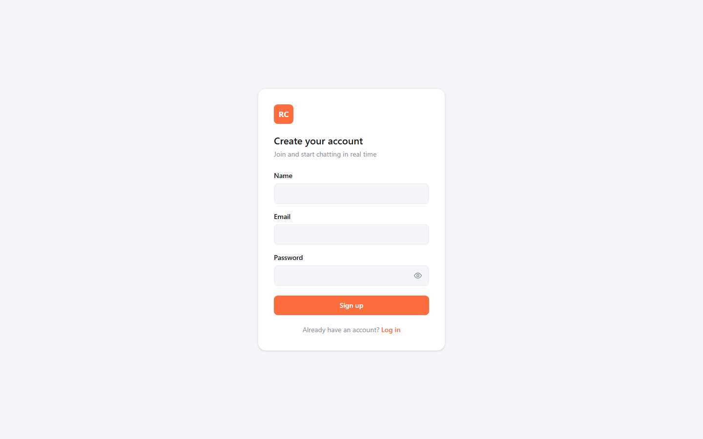
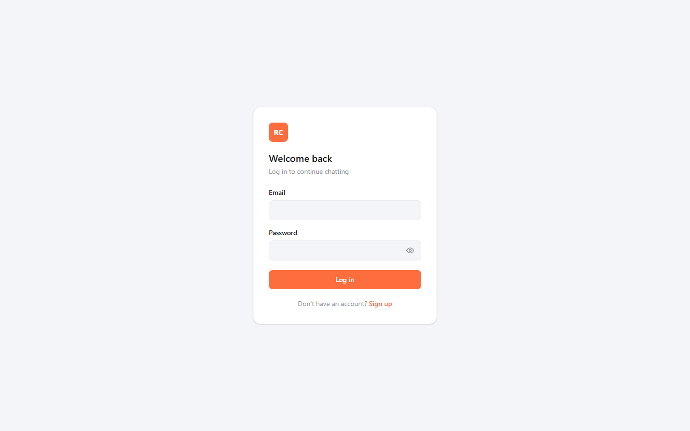
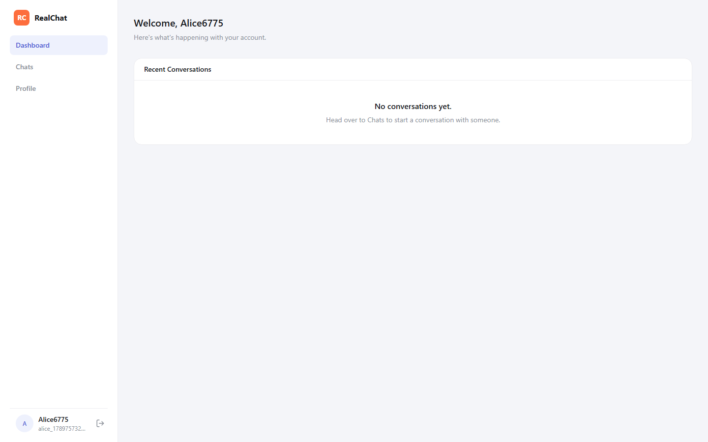
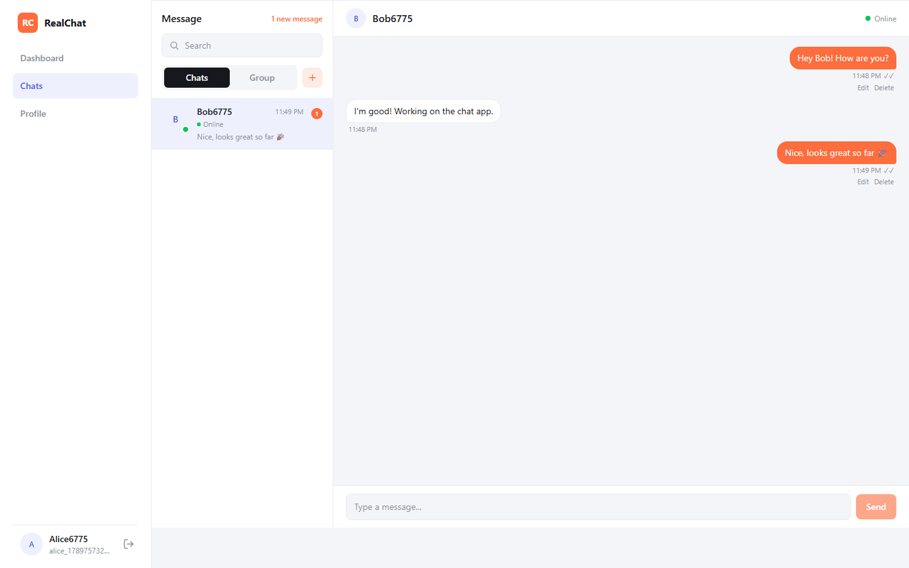
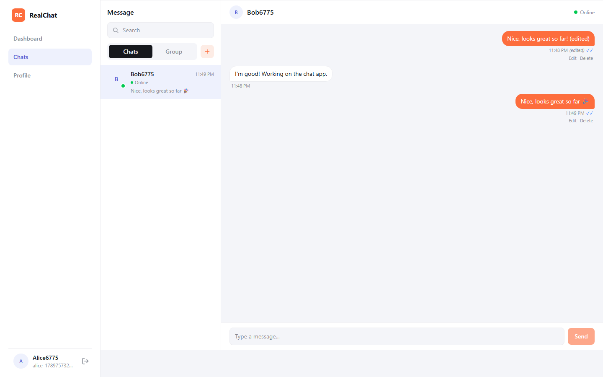
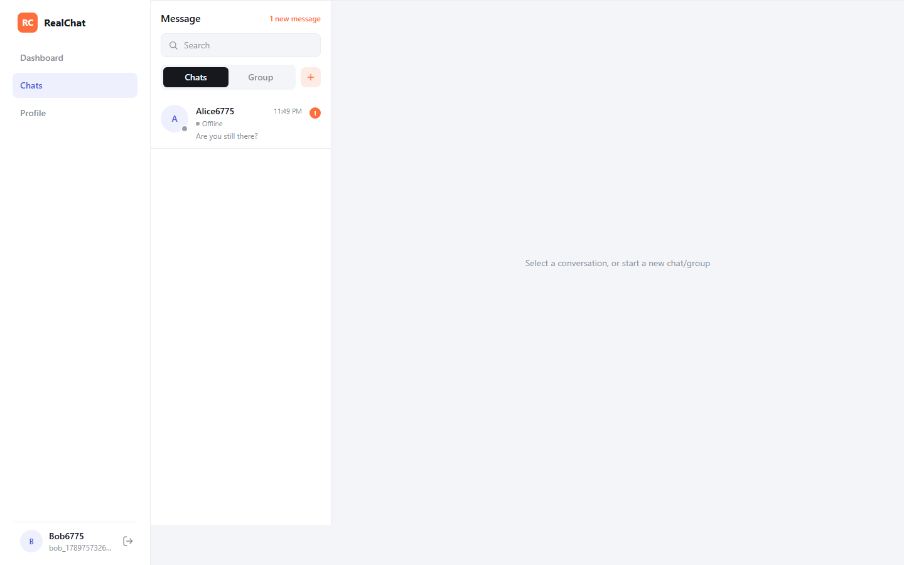
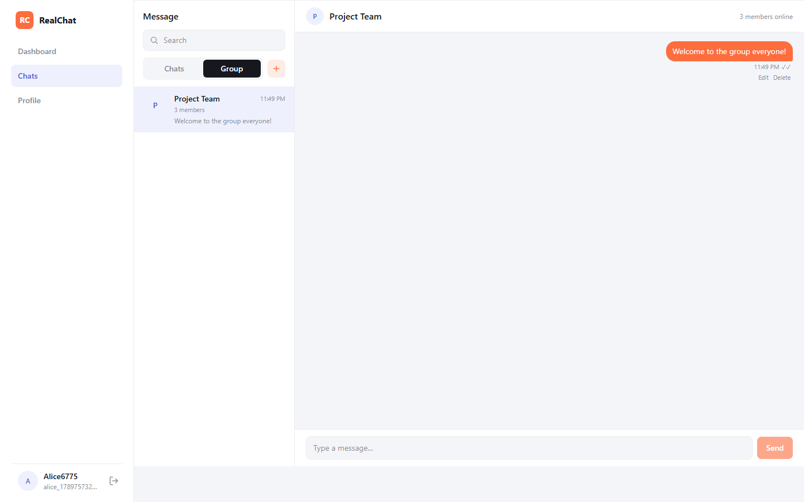
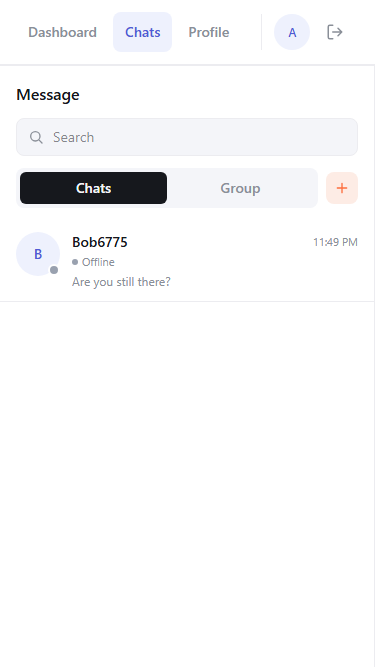
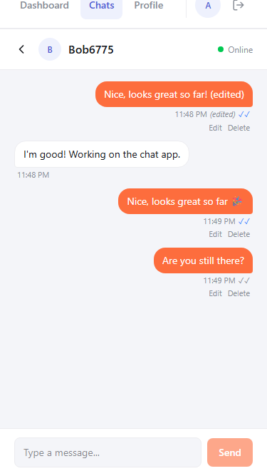

# Real-Time Chat App

A full-stack real-time chat application built incrementally as part of a Netixol internship project. Built with React (Vite + Tailwind CSS) on the frontend and Node.js/Express + Socket.io + MongoDB on the backend.

## Features

- **Authentication:** JWT-based register/login, password hashing with bcrypt, protected routes and protected Socket.io connections.
- **Private (1:1) conversations** and **group conversations** (create, name, add multiple members).
- **Real-time messaging** over Socket.io, delivered to every member instantly — no page refresh needed.
- **Online/offline presence**, aware of multiple tabs/devices per user.
- **Typing indicators** ("X is typing...", "X and Y are typing...", debounced).
- **Message delivery & read receipts** with sent / delivered / read status ticks.
- **Persistent unread message counts** per conversation, shown as a sidebar badge.
- **Message editing and deletion** (owner-only, enforced server-side), with an "(edited)" tag and a soft-delete placeholder.
- **Real-time in-app notifications** (toast) and **browser notifications** (with graceful fallback if permission is denied), deduplicated.
- **Message pagination / infinite scroll**, loading older history on demand with scroll position preserved.
- **Socket reconnection handling** with a visible connection status (Connecting / Reconnecting / Offline / error) and automatic rejoin of the active conversation.
- **Responsive UI** usable on desktop, tablet, and mobile (a dedicated list ↔ chat view toggle on small screens).

## Screenshots

| | |
|---|---|
| Register |  |
| Login |  |
| Dashboard |  |
| Private chat with read receipts |  |
| Editing a message |  |
| In-app toast notification |  |
| Unread badge (after refresh) |  |
| Group conversation |  |
| Mobile — conversation list |  |
| Mobile — chat view (with back button) |  |

## Tech Stack

- **Frontend:** React (Vite), Tailwind CSS, React Router, Axios, Socket.io Client
- **Backend:** Node.js, Express.js, Socket.io
- **Database:** MongoDB (Atlas)
- **Auth:** JWT (jsonwebtoken) + bcryptjs for password hashing — used for both REST requests and Socket.io connection authentication
- **Deployment:** Frontend on Vercel, backend on Railway (a persistent Node process — required for Socket.io, since Vercel's serverless functions don't support long-lived WebSocket connections)

## Project Structure

This is a monorepo. The repo root always holds the current, complete app.

```
real-time-chat/
├── frontend/        # React app (Vite + Tailwind)
├── backend/         # Express API + Socket.io server
│   └── socket/      # Socket.io connection auth, rooms, message events
├── week3/           # Per-day snapshots for evaluation (Day1, Day2, ...)
└── postman-collection.json
```

## Setup & Run Locally

### Backend

```bash
cd backend
npm install
```

Create a `.env` file in `backend/` (see `.env.example`):

```
PORT=5000
MONGO_URI=your_mongodb_atlas_connection_string
JWT_SECRET=your_jwt_secret_key
FRONTEND_URL=http://localhost:5173
```

```bash
npm run dev
```

Backend runs on `http://localhost:5000` (REST API and Socket.io on the same server/port).

### Frontend

```bash
cd frontend
npm install
```

Create a `.env` file in `frontend/` (see `.env.example`):

```
VITE_API_URL=http://localhost:5000/api
VITE_SOCKET_URL=http://localhost:5000
```

```bash
npm run dev
```

Frontend runs on `http://localhost:5173`.

## API Endpoints

| Method | Endpoint | Auth required | Description |
|---|---|---|---|
| GET | `/api/health` | No | Health check |
| POST | `/api/auth/register` | No | Register a new user |
| POST | `/api/auth/login` | No | Log in and receive a JWT |
| GET | `/api/auth/me` | Yes | Get the authenticated user (session check) |
| GET | `/api/users` | Yes | List all other users (to start a conversation) |
| GET | `/api/users/me` | Yes | Get the authenticated user's profile |
| PATCH | `/api/users/me` | Yes | Update `name` and/or `avatar` |
| POST | `/api/conversations` | Yes | Find/create a private conversation (`recipientId`), or create a group (`type: "group"`, `name`, `memberIds`: at least 2 other users, no duplicates, all must exist) |
| GET | `/api/conversations` | Yes | List the authenticated user's conversations (private and group), each with members/other-user info and last message |
| GET | `/api/conversations/:conversationId/messages` | Yes | Get message history for a conversation (chronological, paginated via `limit`/`before`); `GET /api/conversations` also returns a per-conversation `unreadCount` |

Protected routes require an `Authorization: Bearer <token>` header.

## Socket.io Events

The Socket.io connection is authenticated using the same JWT as the REST API, passed via the handshake: `io(url, { auth: { token } })`.

| Event | Direction | Payload | Description |
|---|---|---|---|
| `join_conversation` | Client → Server | `conversationId`, ack callback | Verifies membership, joins the Socket.io room for that conversation. Ack includes `onlineMembers` (user IDs currently online) so the UI has presence info immediately |
| `leave_conversation` | Client → Server | `conversationId` | Leaves the room, stops any typing indicator the user had active there |
| `send_message` | Client → Server | `{ conversationId, content }`, ack callback | Validates membership + content, saves the message, delivers it to every member (see note below) |
| `receive_message` | Server → Client | `{ id, conversationId, senderId, content, createdAt }` | Delivered to every conversation member's personal room (joined by `userId` on connect) — including the sender, and including members who don't currently have this conversation open (so an unread indicator can be shown) |
| `user_online` / `user_offline` | Server → Client | `{ userId }` | Sent to everyone who shares a conversation with that user, when their first socket connects / last socket disconnects (multiple tabs/devices count as one presence) |
| `typing_start` / `typing_stop` | Client ↔ Server | `conversationId` (in), `{ conversationId, userId }` (out) | Client emits on typing/pause/send/leave; server verifies membership and re-broadcasts to the conversation room only (`socket.to(...)`, so the typer never gets their own event back) |
| `mark_messages_read` | Client → Server | `conversationId` | Marks every unread message in that conversation (sent by someone else) as read + delivered for the caller |
| `message_delivered` / `message_read` | Server → Client | `{ conversationId, messageIds, userId }` | Sent to every member's personal room when messages become delivered (recipient came online / opened the app) or read (recipient called `mark_messages_read`), so the sender's UI can update ✓ → ✓✓ → ✓✓ (blue) |
| `edit_message` | Client → Server | `{ messageId, content }`, ack callback | Owner-only (verified against `message.senderId`, never trusting a client-supplied ID); rejects empty content or editing a deleted message |
| `message_edited` | Server → Client | `{ id, conversationId, content, edited, editedAt }` | Broadcast to every member on a successful edit |
| `delete_message` | Client → Server | `{ messageId }`, ack callback | Owner-only; soft-deletes (`isDeleted: true`, content replaced with a placeholder) rather than removing the document |
| `message_deleted` | Server → Client | `{ id, conversationId, content, isDeleted }` | Broadcast to every member on a successful delete |

## Testing

See [`docs/TESTING_RESULTS.md`](docs/TESTING_RESULTS.md) for the final acceptance-criteria checklist and results (what was tested, how, and the outcome — including what was explicitly *not* individually exercised).

### REST API — Postman collection

`postman-collection.json` covers the full REST surface (auth, users, conversations/messages), organized into **Health / Auth / Users / Conversations & Messages** folders. Every request has an automated `pm.test()` assertion, and collection variables (`tokenA`, `userIdB`, `conversationId`, etc.) are captured automatically as you run requests top-to-bottom, so later requests don't need manual copy-pasting of ids/tokens.

Import it into Postman, set `baseUrl` if not testing against `http://localhost:5000/api`, and run **Auth > Register User A/B/C/D** first (in that order) — everything else depends on the tokens/ids those capture. The collection also includes a `[Negative]` -prefixed request for every validation rule (missing/invalid fields, wrong credentials, missing/bad auth, invalid ids, unauthorized access, etc.), so running the whole collection top-to-bottom doubles as a regression check.

### Socket.io / real-time messaging — manual multi-user walkthrough

Socket.io events aren't testable through Postman, so exercise them through the actual UI with multiple simultaneous sessions:

1. Run the backend and frontend locally (or use the deployed URLs).
2. Register three different user accounts (A, B, C) — three lets you exercise a group conversation properly, not just 1:1.
3. Open the app in three separate browser sessions (e.g., one normal window, one incognito window, and a different browser) — one per user, so each has its own token/socket.
4. **Private chat:** log in as A and B, start a conversation, send messages back and forth — each should appear in the other tab immediately, with the status tick progressing ✓ (sent) → ✓✓ grey (delivered) → ✓✓ blue (read) once the recipient opens the conversation.
5. **Edit/delete:** as the sender, edit a message (see the "(edited)" tag appear for both users) and delete one (see it replace with the deleted-message placeholder for both users). Confirm the *other* user cannot edit/delete your message (no Edit/Delete buttons show on messages that aren't theirs).
6. **Group chat:** as A, create a group with B and C, send a message, and confirm it reaches both B and C in real time.
7. **Presence & typing:** watch the green/grey online dot update as a user closes their tab; start typing in one session and confirm "X is typing..." appears for the others (and clears after a pause or on send).
8. **Unread counts & notifications:** with B's conversation with A *not* open, send a message from A — B should see an in-app toast and a numeric unread badge in the sidebar, both clearing once B opens the conversation.
9. **Refresh persistence:** refresh any tab mid-conversation — the same message history, read state, and unread counts should reload from the database, not reset.
10. **Reconnection:** stop and restart the backend (or use dev tools to go offline/online) while a tab is connected — the sidebar should show a "Reconnecting..." / "Offline" status, then clear and resume working once the connection is back, without needing a manual refresh.
11. **Unauthorized access:** with a 4th user who was never added to A/B's conversation, confirm `GET /api/conversations/:id/messages` returns `403` for that conversation (covered by the Postman collection's `[Negative] Get messages - non-member forbidden` request) — the same rule Socket.io's `join_conversation`/`send_message`/etc. enforce for the real-time side.

### Automated checks run during development

This project's own development relied on scripted checks rather than only manual clicking — useful as a reference if you want to write your own:

- A raw `socket.io-client` Node script exercising delivery, read receipts, edit/delete ownership, unread counts, and pagination directly against the backend (no browser needed) — fast enough to run after every backend change.
- Playwright scripts driving two simultaneous browser sessions through the full private-chat flow (send, edit, delete, notifications, unread badges) and a mobile-viewport pass checking the list ↔ chat toggle described above.
- A plain HTTP script replaying every request/assertion in the Postman collection, used to verify the collection itself before committing it.

These aren't checked into the repo (they were throwaway scripts run against a local instance during development, not a maintained test suite), but the patterns above are straightforward to reproduce with `socket.io-client` and `playwright` if you want an automated regression check.

## Week 3 — Day 1: Project Setup, Database Design & Authentication

**What was built:**

- Backend project structure separating `routes`, `controllers`, `models`, `middleware`, `config`, and `utils`.
- MongoDB connection via Mongoose, with environment variables for the DB connection string, JWT secret, and frontend URL.
- User registration with validation (required fields, email format, minimum password length), duplicate-email rejection, and bcrypt password hashing.
- Login with JWT generation on success.
- `protect` middleware that verifies the JWT and attaches the authenticated user to `req.user`, used to guard `/api/auth/me` and `/api/users/me`.
- User profile endpoints (`GET`/`PATCH /api/users/me`).
- Mongoose models for `User`, `Conversation`, `ConversationMember`, and `Message`, designed for the messaging features planned in upcoming days.
- Frontend: Login, Register, Dashboard, and Profile pages, an `AuthContext` for global auth state (persisted to `localStorage`), a `ProtectedRoute` component guarding the dashboard/profile routes, and an Axios instance that automatically attaches the JWT to outgoing requests.
- Styled with Tailwind CSS, following a reference dashboard design (sidebar navigation, card-based layout).

**Key architectural decisions:**

- **`bcryptjs` over `bcrypt`** — pure-JS implementation, avoids native build issues on Windows.
- **Auth state in React Context (`AuthContext`)** rather than prop-drilling, since login state is needed by the sidebar, protected routes, and multiple pages.
- **Both `GET /api/auth/me` and `GET /api/users/me`** exist because the task specified both explicitly (one as an auth/session check, one as a user-resource endpoint), even though they currently return the same data.
- **`process.exit(1)` was removed from the MongoDB connection error handler** — appropriate for a traditional long-running server, but dangerous in a serverless environment where it crashes the entire function on any transient DB error instead of just failing that one request.
- **Dashboard's "Welcome" message is conditional** on how the user arrived (fresh registration vs. login) — "Welcome back" only makes sense for a returning, logged-in user.

## Week 3 — Day 2: Socket.io Integration, Rooms & Real-Time Messaging

**What was built:**

- Socket.io server attached to the same HTTP server as Express, with a handshake-level auth middleware (`io.use`) that verifies the JWT and attaches `socket.userId`, same as the REST `protect` middleware.
- `join_conversation` / `leave_conversation` events with membership verification against `ConversationMember` before joining a room, rejecting non-members.
- `send_message` event: validates membership and content (rejecting empty/whitespace-only messages), saves the message, and broadcasts it to the conversation's room (including back to the sender, so the UI never needs to optimistically render a message it hasn't confirmed).
- `POST /api/conversations` (find-or-create a private conversation) and `GET /api/conversations` (list with last message preview) and `GET /api/conversations/:id/messages` (paginated history).
- Frontend: a Socket.io client singleton (`api/socket.js`) connected on login and disconnected on logout, wired into `AuthContext` with a `socketStatus` ('connecting' | 'connected' | 'disconnected' | 'error') exposed to the UI. A full Chat page (user list, message thread, connection indicator, send form) and a Dashboard that now shows real recent conversations instead of a placeholder.

**Key architectural decisions / bugs found and fixed:**

- **Backend moved from Vercel to Railway.** Vercel's serverless functions don't support persistent WebSocket connections, which Socket.io needs. Railway runs a normal long-lived Node process, so `server.js` was simplified to always call `httpServer.listen()` (no more conditional based on `NODE_ENV`), and the Vercel-specific `vercel.json` for the backend was removed.
- **MongoDB connection is lazily established per-request** (via Express middleware calling `connectDB()`, which caches the connection after the first successful connect) rather than once at startup — needed because serverless/on-demand platforms can spin up a fresh process per request, and the app must not try to run a query before the DB connection exists.
- **Race condition in conversation creation:** if two users started a conversation with each other at almost the same moment, both requests could independently pass the "does a conversation already exist?" check before either had created one, resulting in two separate conversations — the two users would then be in different Socket.io rooms and never see each other's messages. Fixed with a unique, sparse `pairKey` field on `Conversation` (sorted, joined user IDs) and a create-then-catch-duplicate-key pattern, so the database itself guarantees only one conversation per user pair.
- **Mongoose indexes were not being built reliably** on connect in this setup; `connectDB()` now explicitly calls `Conversation.syncIndexes()` after connecting to guarantee the `pairKey` uniqueness constraint actually exists.
- **`send_message`/`receive_message` avoid duplicate rendering** by never optimistically adding a sent message to the UI — the frontend only ever appends a message when the `receive_message` event arrives (which happens for the sender too), so there's exactly one source of truth for what's on screen.

## Week 3 — Day 3: Group Conversations, Presence & Typing Indicators

**What was built:**

- Group conversations: `POST /api/conversations` with `type: "group"` validates the name, member list (≥2 others, no duplicates, all must exist as real users), auto-adds the creator, and creates the group + memberships.
- `GET /api/conversations` now returns both private and group conversations in one list, each shaped appropriately (group: `name` + `members`; private: `otherUser`).
- Online/offline presence: an in-memory `Map<userId, Set<socketId>>` tracks how many active sockets each user has (multiple tabs/devices), so a user is only marked offline once their *last* socket disconnects. `user_online`/`user_offline` are broadcast only to users who actually share a conversation with them.
- Typing indicators with client-side debounce: typing emits `typing_start` once, then a 2s idle timer emits `typing_stop`; sending a message, leaving the conversation, or disconnecting also stops it immediately. The UI renders "X is typing...", "X and Y are typing...", or "N people are typing...".
- Chat UI reworked into a proper conversation list (private + group, last-message preview) instead of a flat "pick a user" list, with inline panels to start a new 1:1 chat or create a group.
- Show/hide toggle on password fields (`PasswordInput` component, shared by Login and Register).
- Unread-message indicator: a dot on any conversation in the sidebar that received a message while it wasn't the open conversation, cleared when opened.

**Key architectural decisions / bugs found and fixed:**

- **Message delivery moved from the conversation room to each member's personal room.** Originally `send_message` broadcast via `io.to(conversationId)`, but a user only joins that room when they actively open the conversation — so a member who hadn't opened it yet would never receive the event, making the unread-indicator feature impossible. Every socket already joins a room named by its own `userId` on connect (for presence); `send_message` now emits to each member's `userId` room instead, so everyone gets notified regardless of what they currently have open. Typing indicators intentionally stayed scoped to the conversation room (`socket.to(conversationId)`) — showing "typing..." to someone who doesn't even have the chat open isn't useful.
- **A real crash bug:** Socket.io connections don't go through Express's middleware chain, so the `connectDB()`-per-request pattern from Day 2 never ran for a socket-only connection. The new presence code queried MongoDB immediately on connect, and if no HTTP request had happened first, Mongoose's query buffer would time out after 10s and throw an *unhandled* rejection inside an `async` Socket.io handler — which crashes the whole Node process, not just that connection. Fixed by calling `connectDB()` explicitly at the top of the connection handler, and wrapping every async socket event handler in a `safe()` helper that catches and logs errors instead of taking the server down (the kind of centralized-error-handling gap flagged in the Day 1 review, applied here so it isn't repeated).
- **A React 18 StrictMode double-socket bug:** in dev, StrictMode invokes effects twice. `AuthContext`'s mount effect had a cleanup that called `disconnectSocket()`, so the sequence became connect → (StrictMode test-cleanup) disconnect → connect again — and `connectSocket()`'s guard (`if (socket?.connected) return socket`) didn't catch the second call because the first connection hadn't finished its handshake yet (`.connected` was still `false`), so a second, separate socket object got created. Any component whose effects had already grabbed the first (now-abandoned) socket reference — like Chat's message/presence listeners — kept listening on a dead connection while the real traffic went through the second one. Fixed two ways: removed the unnecessary disconnect-on-cleanup from `AuthContext` (a session-wide socket has no business tearing down on a component re-mount), and changed the guard to `if (socket) return socket` so simply having created a socket already (connected or not) is enough to reuse it.
- **Backfilled a Day 2 bug this surfaced:** conversations created before the `pairKey` fix landed had no `pairKey`, so reopening one of those (e.g. from the Dashboard) would silently create a *second*, empty conversation for the same pair instead of reusing the original — messages looked like they'd "disappeared." A one-time migration script backfilled `pairKey` on every pre-existing private conversation and merged any duplicates it found (moving their messages onto the oldest conversation before deleting the duplicate), then was deleted — it was a one-off data fix, not part of the app.
- **A silent effect-ordering bug that only showed up on a fresh page load:** React fires a child component's effects before its parent's. `Chat`'s effect that attaches Socket.io listeners (`receive_message`, presence, typing) ran once on mount with an empty dependency array, calling `getSocket()` to grab the socket `AuthContext` (a parent) creates. When a user arrived via normal in-app navigation (login → dashboard → click into Chat), the socket already existed from the earlier login step, so this worked. But landing directly on `/chat` — a real page load, e.g. a refresh or this test doing `page.goto('/chat')` — starts the whole component tree fresh, and `Chat`'s effect fired *before* `AuthContext`'s effect had created the socket, so `getSocket()` returned `null` and the listeners were never attached — silently; no error was thrown. Messages, presence, and typing simply never appeared for that page load, while REST calls and sending still worked (they call `getSocket()` fresh at click-time, not from a stale effect closure). Fixed by making the effect depend on `socketStatus` from `AuthContext`, so it re-runs and successfully grabs the socket once it actually exists.

## Week 3 — Day 4: Advanced Messaging, Read Receipts & Notifications

**What was built:**

- **Delivery/read tracking:** `Message` gained `deliveredTo`/`readBy` (arrays of user IDs), `edited`/`editedAt`, and `isDeleted`. A message is marked delivered the moment an online recipient receives it (or, if they were offline, via a catch-up pass that runs when they next connect), and read when the recipient calls `mark_messages_read`. The UI shows a single grey ✓ (sent), double grey ✓✓ (delivered), or double blue ✓✓ (read) — for groups, "read"/"delivered" requires *every* other member to have reached that state.
- **`mark_messages_read`**, fired automatically when a conversation is opened and whenever a new message arrives while it's already open, broadcasts `message_read` to every member so the sender's ticks update in real time.
- **Persistent unread counts:** `GET /api/conversations` now returns a server-computed `unreadCount` per conversation (messages from someone else not yet in the caller's `readBy`), so the sidebar badge survives a refresh instead of resetting.
- **Message editing** (`edit_message`) and **soft-delete** (`delete_message`), both owner-only — checked against `message.senderId` on the server, never a client-supplied ID — with edits showing an "(edited)" tag and deletes replacing the content with "This message was deleted." (kept as a record, not removed, so surrounding messages/read-receipts stay consistent).
- **Notifications with no duplicates:** an in-app toast (auto-dismissing, click-to-open) for any message that arrives while its conversation isn't open, plus a native browser `Notification` (only if permission was granted; the app works fine if denied) that focuses the window and navigates to the conversation on click.
- **Pagination / infinite scroll:** `GET /.../messages` already supported `limit`/`before`; the Chat page now loads the most recent 30 on open and fetches another page when the user scrolls near the top, splicing older messages in while preserving scroll position (captures `scrollHeight` before prepending, restores `scrollTop` after — so the view doesn't jump).
- **UX polish:** auto-scroll to bottom for new messages (only while already near the bottom, so reading history isn't interrupted), a scroll-to-bottom button once the user has scrolled away, a "New Messages" divider placed at the first unread message when a conversation is opened, and loading/empty states for the message list.

**Key architectural decisions / bugs found and fixed:**

- **A listener-registration race that silently dropped events.** The Socket.io connection handler used to `await connectDB()` and run catch-up-delivery queries *before* registering any `socket.on(...)` handlers. On a slow database connection, a client that emitted `join_conversation` immediately after connecting could fire before the server had attached a listener for it — Socket.io does not buffer events for listeners added later, so the emit was silently lost and its ack never arrived, hanging the caller indefinitely. This surfaced as backend tests hanging with zero errors logged. Fixed by registering every event handler synchronously, right after `socket.join(socket.userId)`, and moving `connectDB()` / presence / catch-up-delivery to run *after* — so a client can never race the server's own setup.
- **Two MongoDB connection robustness gaps**, found while testing against an unusually slow Atlas connection: `config/db.js`'s `isConnected` flag was never rechecked against `mongoose.connection.readyState`, so once true it stayed true even if the connection had actually dropped, sending every later query into a doomed 10s buffering timeout instead of reconnecting. Fixed by also checking `readyState === 1` and resetting the flag to `false` on a failed connect. Separately, a query on a connection whose TCP path died silently (no FIN/RST) could hang forever with no error, since the driver has no default `socketTimeoutMS`; added an explicit one so a truly stuck query fails instead of hanging the caller.
- **Duplicate messages/listeners under React 18 StrictMode.** `AuthContext`'s `attachSocket()` calls `socket.on('connect', ...)` etc. every time it's called — but it *is* called more than once for the very same (cached) socket, since the mount effect that calls it runs twice under StrictMode. Each extra call piled on another listener, and while duplicate `connect`/`disconnect` listeners were harmless on their own (same-value `setState` calls are no-ops), the pattern is exactly the kind of bug that shows up destructively elsewhere — confirmed live via a Playwright test: React logged "two children with the same key" for a sent message, because it existed twice in the `messages` array. Fixed at the source (`attachSocket` now guards with a `_statusListenersAttached` flag on the socket so it only ever attaches once), and hardened `handleReceive` to dedupe by message ID before appending regardless — belt-and-braces, since Day 4's "no duplicate notifications" requirement makes this exactly the class of bug to guard against structurally, not just fix once.
- **Toast showed "Someone" instead of the sender's name for a brand-new conversation.** When a message arrives for a conversation the recipient doesn't have in local state yet (someone just started a first-time chat with them), the code re-fetches the full conversation list to pick up the new one — but was building the toast *before* that fetch resolved, off the stale (conversation-less) local list. Fixed by deferring the toast until the re-fetch actually completes, then resolving the sender's name from the freshly-fetched data.

**Testing note:** MongoDB Atlas was unusually slow during this session's testing (single queries taking 5–20s at times), which is why the backend test suite and the Playwright frontend suite both needed generous, poll-based waits rather than fixed short timeouts — the two real bugs above (the listener race and the duplicate-key issue) were only two of a longer list of suspects until backend logs and browser console output ruled network flakiness in or out for each failure individually.

## Week 3 — Day 5: Final Integration, Testing, Optimization & Deployment

**What was done:**

- **Full regression pass** across all Day 1–4 features (auth, private/group chat, presence, typing, read receipts, edit/delete, notifications, pagination) — automated backend (10 cases) and Playwright browser (13 cases) suites both green after every change below, confirming nothing broke.
- **Visible connection status.** `socketStatus` was already tracked in `AuthContext` (`connecting`/`connected`/`disconnected`/`error`) but never actually shown anywhere in the UI — a real gap against this project's own "display connection status" requirement. Added a `reconnecting` state (via `socket.io.on('reconnect_attempt', ...)`, distinct from the initial `connecting`) and a small status banner in the Chat sidebar that appears only when not connected ("Connecting...", "Reconnecting...", "Offline — trying to reconnect...", "Connection error").
- **Database indexes:** a compound `{ conversationId: 1, createdAt: -1 }` index on `Message` (covers history fetch, cursor pagination, and unread counts — all filter by conversation and sort/page by time), and on `ConversationMember` a unique `{ conversationId: 1, userId: 1 }` (also enforces one membership row per user per conversation at the DB level) plus a `{ userId: 1 }` index for "which conversations am I in" lookups used on every connect.
- **Input validation edge cases:** every socket event and REST endpoint taking a `conversationId`/`messageId`/`recipientId`/`memberIds` now validates it's a real MongoDB ObjectId before querying, returning a clean `{ success: false, message }` (socket) or `400` (REST) instead of letting an invalid id reach Mongoose as a `CastError`. Message content is capped at 5000 characters both client-side (`maxLength`) and server-side (schema `maxlength` + an explicit check), rejecting an oversized message with a clear error instead of silently truncating or erroring obscurely.
- **Centralized 404 + error handler** added to `server.js` — an unmatched route now returns a clean `404` instead of Express's default HTML error page, and any error that reaches Express without being caught by a controller's own `try/catch` is logged server-side and returns a generic `500` rather than leaking internals to the client.
- **Cleaned up `error.message` leaks** in every REST controller (`authController`, `userController`, `conversationController`) — a pattern flagged back in the Day 1 review as deferred, now fixed since Day 5's security pass makes it explicitly in scope: the real error is still logged server-side (`console.error`) but the client only ever gets a generic message.
- **Verified production readiness:** frontend builds cleanly (`vite build`), backend starts and passes the full test suite in production mode (`npm start`, no nodemon), both `.env.example` files are accurate and contain no real secrets, and the real `.env` files are confirmed `.gitignore`d and not tracked in the repo.

**Bugs found and fixed:**

- **Day 2 review carry-over, issue #3 (message-loss race):** `openConversation` fetched message history *before* joining the conversation's Socket.io room — a message sent by the other person in that gap wasn't in the already-fetched history and wasn't received live either (the socket wasn't in the room yet), so it was invisible until the conversation was reopened or the page refreshed. This was flagged in the Day 2 review and, while some of that review's other findings had already been fixed incidentally by Day 3/4 work (the crash-on-bad-input issue via the `safe()` wrapper, sender names via group chat), this specific ordering bug was still present in the live code. Fixed by joining the room first, then fetching history, then merging (deduped by message id) with anything that arrived live in between — so a message from that gap is neither lost nor duplicated.
- **Connection status silently tracked but never shown** (details above) — not a crash or data bug, but a real gap against an explicit requirement, only surfaced by deliberately checking "where does `socketStatus` actually get read?" and finding the answer was "nowhere in the JSX."

**Testing:** Verified end-to-end with two simultaneous automated browser sessions (register → private chat → real-time message → delivery/read receipts → edit → delete → reconnection after a real server restart, confirming the new status banner and the existing rejoin-active-conversation-on-reconnect logic both work). A literal 3-way manual walkthrough with screenshots, a full mobile/tablet responsive pass, and every individual edge case in the Day 5 checklist (very long message, user removed from a group mid-session, simultaneous edit/delete, empty conversation, large message history, etc.) were not each exhaustively exercised in this session — the ones with a concrete, checkable failure mode (invalid IDs, oversized messages, connection recovery) were prioritized and verified; the rest are covered by the same validation/error-handling patterns but haven't each been individually clicked through.

## Deployment

- **Frontend:** [real-time-chat-frontend-steel.vercel.app](https://real-time-chat-frontend-steel.vercel.app) — deployed on Vercel (root directory: `frontend`).
- **Backend:** deployed on Railway (root directory: backend, via a root-level `package.json` wrapper — `npm --prefix backend install && npm --prefix backend start` — for compatibility with platforms that expect a single app at the repo root). Railway was chosen because it runs a persistent process, which Socket.io requires.
